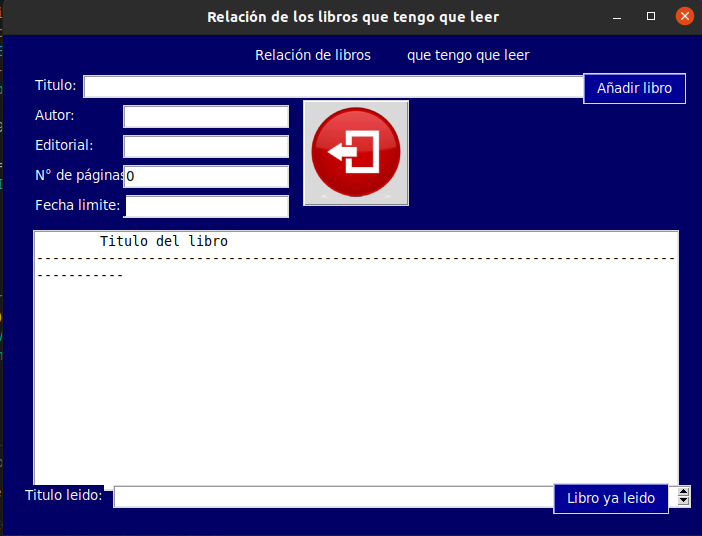
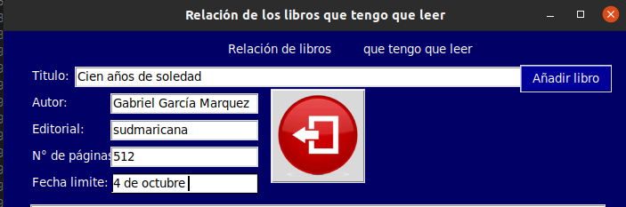
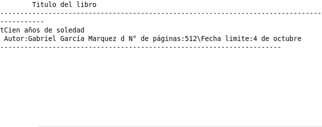
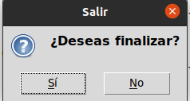

# Este proyecto permitira tener un control sobre los libros que lees.

# control_libro

## Te permitira registrar los datos del libro para asi poder cumplir 
## su funcion que es guardarlo en tu biblioteca los libros que vas a leer y que leiste 

# nos saldra lo siguiente en la pantalla donde toca ubicar lo asignado del libro, tendras que saber el nombre del libro,autor etc. Para que puedas registrarte bien.

 

# Resultado 

## Despues de agregar el libro, aparecera lo siguente:

# salir 

## tendras un button donde podras salir, solo tiene que presionarlo y asi podras cerra el registro.

     

